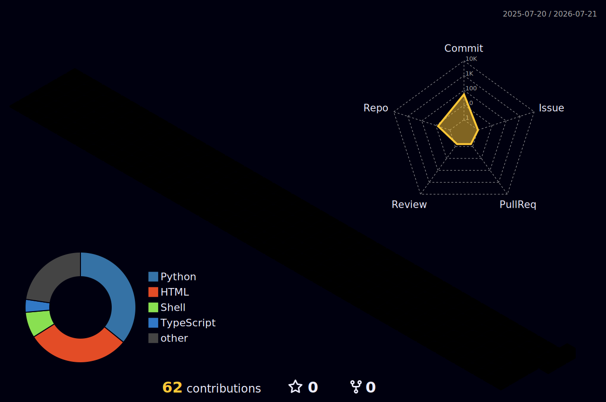

  

 
    <h2 style="border-bottom: 1px solid #21262d; color: #c9d1d9;">  </h2>  
    
 The Best is yet to come</li> 
 
    

    

 
  <h2 style="border-bottom: 1px solid #21262d; color: #c9d1d9;"> </h2>  
  
 
 

  <h2 style="border-bottom: 1px solid #21262d; color: #c9d1d9;"> 🛠️ Tech Stacks </h2>   
  

    
    
    
  

<h2 style="border-bottom: 1px solid #21262d; color: #c9d1d9;"> </h2> 
 

  

